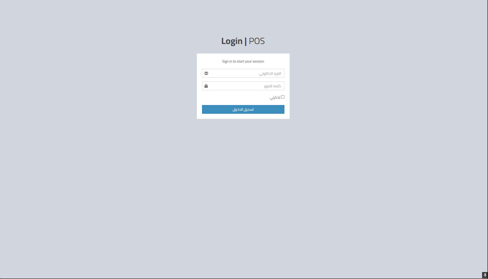
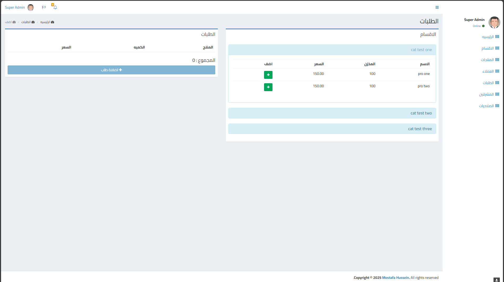
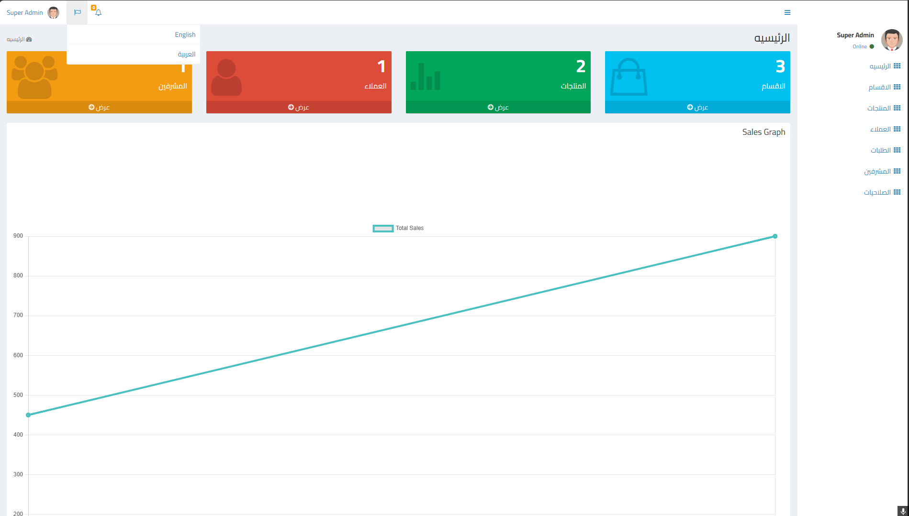
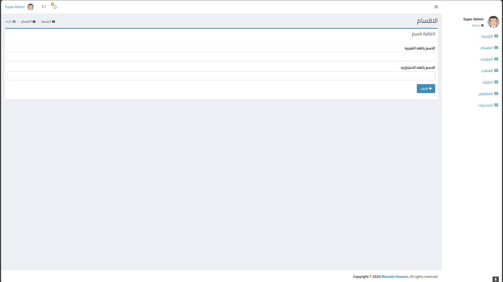
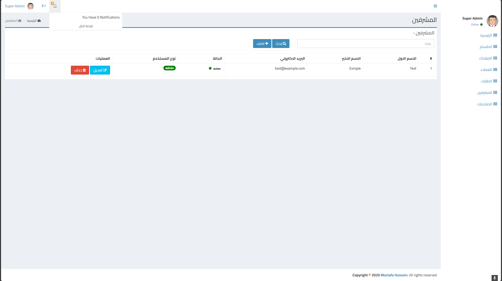
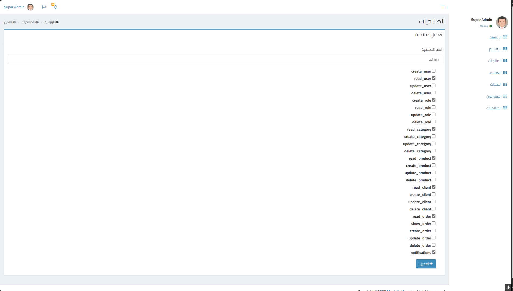

## About POS System
📌 Point of Sale (POS) System Using Laravel & MySQL 🛒💳  

I have developed a comprehensive Point of Sale (POS) system using Laravel and MySQL, designed for store owners and  businesses to efficiently manage sales operations, price products, and organize invoices and payments with ease and  professionalism.

## 🎯 System Features
✅ Product Management 🏷️  
Add, update, and categorize products easily.

✅ Sales Operations 🛍️  
Generate invoices for sales and purchases, with the option to print or send them electronically.

✅ Customer & Supplier Management 👥  
Store customer and supplier details to track transactions effortlessly.

✅ User Roles & Permissions 🔐  
Utilizes Laravel Bootstrap Auth for secure login and role-based access control for store employees.

✅ Reports & Analytics 📊  
Detailed reports on sales, profits, and inventory, with graphical analysis for better decision-making.

✅ Multi-Device Compatibility 📱💻  
Accessible from desktops, tablets, and mobile devices for flexible sales management. 

🚀 Wait for the next updates.

## Screenshots 📷

